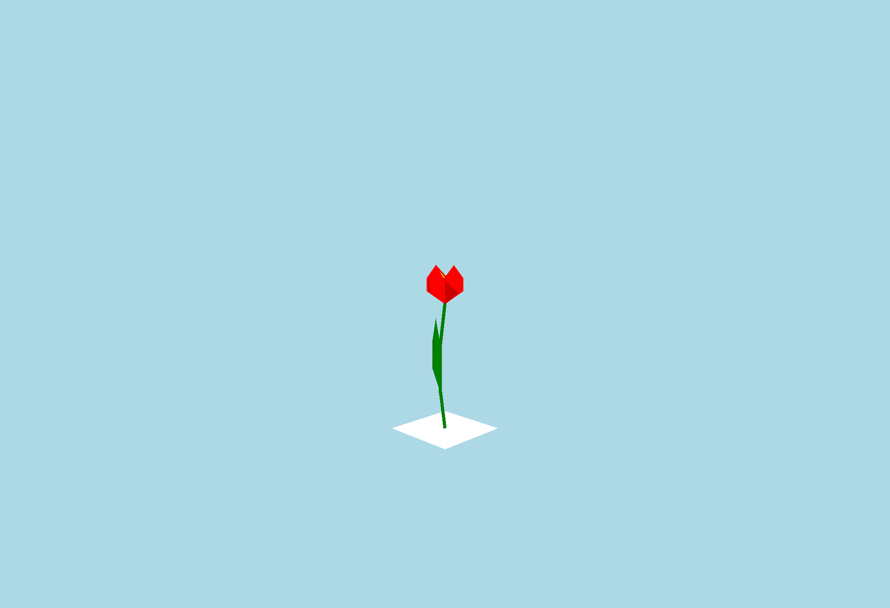

# Fresh

A P5.JS program for drawing Tulips. Done as part of a family art project on the theme of "Fresh".

For a working version, see: http://www.mrmatsumoto.com/experiments/Fresh/index.html

- Use + and - to add or remove Tulips.
- Use [ and ] to increase or decreas spacing.
- S to save as a picture.
- G to show and hide the settings.

.png)
.png)
.png)
.png)
.png)
.png)
